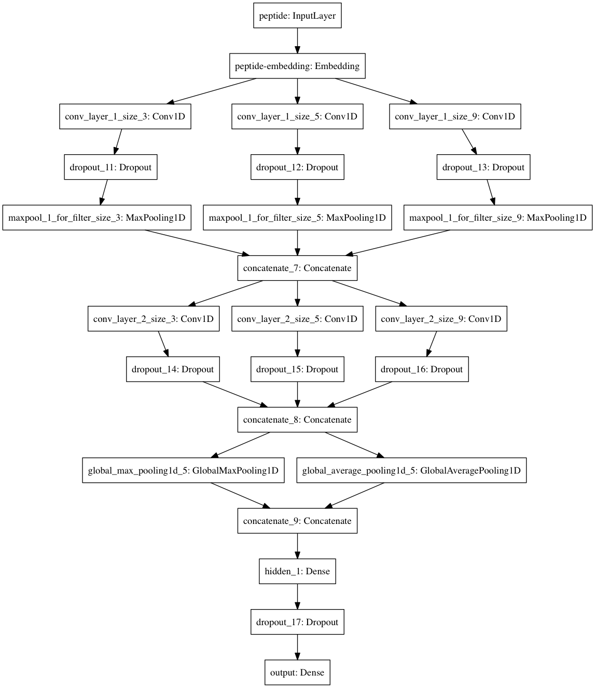

<a href="https://travis-ci.org/openvax/pepnet">
    
</a>
<a href="https://coveralls.io/github/openvax/pepnet?branch=master">
    
</a>
<a href="https://pypi.python.org/pypi/pepnet/">
    
</a>

# pepnet
Neural networks for amino acid sequences

## Predictor API

Sequence and model construction can both be handled for you by pepnet's
`Predictor`:

```python
from pepnet import Predictor, SequenceInput, NumericInput, Output
predictor = Predictor(
    inputs=[
        SequenceInput(length=4, name="x1", variable_length=True),
        NumericInput(dim=30, name="x2")],
    outputs=[Output(name="y", dim=1, activation="sigmoid")],
    dense_layer_sizes=[30],
    dense_activation="relu")
sequences = ["ACAD", "ACAA", "ACA"]
vectors = np.random.normal(10, 100, (3, 30))
y = numpy.array([0, 1, 0])
predictor.fit({"x1": sequences, "x2": vectors}, y)
y_pred = predictor.predict({"x1": sequences, "x2": vectors})["y"]
```

## Convolutional sequence filtering

This model takes an amino acid sequence (of up to length 50) and applies to it two layers of 9mer convolution with 3x maxpooling and 2x downsampling in between. The second layer's activations are then pooled across all sequence positions (using both mean and max pooling) and passed to a single dense output node called "y".

```python
peptide =
predictor = Predictor(
    inputs=[SequenceInput(
        length=50, name="peptide", encoding="index", variable_length=True,
        conv_filter_sizes=[9],
        conv_output_dim=8,
        n_conv_layers=2,
        global_pooling=True)
    ],
    outputs=[Output(name="y", dim=1, activation="sigmoid")])
```


## Manual index encoding of peptides

Represent every amino acid with a number between 1-21 (0 is reserved for padding)

```python
from pepnet.encoder import Encoder
encoder = Encoder()
X_index = encoder.encode_index_array(["SYF", "GLYCI"], max_peptide_length=9)
```

## Manual one-hot encoding of peptides

Represent every amino acid with a binary vector where only one entry is 1 and
the rest are 0.

```python
from pepnet.encoder import Encoder
encoder = Encoder()
X_binary = encoder.encode_onehot(["SYF", "GLYCI"], max_peptide_length=9)
```

## FOFE encoding of peptides

Implementation of FOFE encoding from [A Fixed-Size Encoding Method for Variable-Length Sequences with its Application to Neural Network Language Models](https://arxiv.org/abs/1505.01504)

```python
from pepnet.encoder import Encoder
encoder = Encoder()
X_binary = encoder.encode_FOFE(["SYF", "GLYCI"], bidirectional=True)
```
## Example network

Schematic of a convolutional model: 

