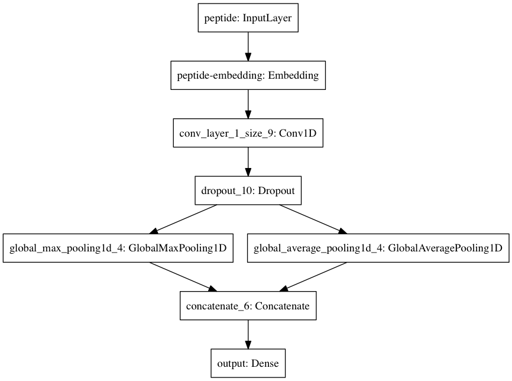

[](https://travis-ci.org/hammerlab/pepnet)

# pepnet
Neural networks for amino acid sequences

## Predictor API

Sequence and model construction can both be handled for you by pepnet's
`Predictor`:

```python
from pepnet import Predictor, SequenceInput, NumericInput, Output
predictor = Predictor(
    inputs=[
        SequenceInput(length=4, name="x1", variable_length=True),
        NumericInput(dim=30, name="x2")],
    outputs=[Output(name="y", dim=1, activation="sigmoid")],
    hidden_layer_sizes=[30],
    hidden_activation="relu")
sequences = ["ACAD", "ACAA", "ACA"]
vectors = np.random.normal(10, 100, (3, 30))
y = numpy.array([0, 1, 0])
predictor.fit({"x1": sequences, "x2": vectors}, y)
y_pred = predictor.predict({"x1": sequences, "x2": vectors})["y"]
```

## Manual index encoding of peptides

Represent every amino acid with a number between 1-21 (0 is reserved for padding)

```python
from pepnet.encoder import Encoder
encoder = Encoder()
X_index = encoder.encode_index_array(["SYF", "GLYCI"], max_peptide_length=9)
```

## Manual one-hot encoding of peptides

Represent every amino acid with a binary vector where only one entry is 1 and
the rest are 0.

```python
from pepnet.encoder import Encoder
encoder = Encoder()
X_binary = encoder.encode_onehot(["SYF", "GLYCI"], max_peptide_length=9)
```

## FOFE encoding of peptides

Implementation of FOFE encoding from [A Fixed-Size Encoding Method for Variable-Length Sequences with its Application to Neural Network Language Models](https://arxiv.org/abs/1505.01504)

```python
from pepnet.encoder import Encoder
encoder = Encoder()
X_binary = encoder.encode_FOFE(["SYF", "GLYCI"], bidirectional=True)
```

## Fixed-length peptide input represented by one-shot binary vectors

```python
from pepnet.feed_forward import make_fixed_length_hotshot_network

# make a model whose input is a single amino acid
model = make_fixed_length_hotshot_network(peptide_length=1, n_symbols=20)
X = np.zeros((2, 20), dtype=bool)
X[0, 0] = True
X[1, 5] = True
Y = np.array([True, False])
model.fit(X, Y)
```


## Fixed-length peptide input represented by learned amino acid embeddings
```python
from pepnet.feed_forward import make_fixed_length_embedding_network
model = make_fixed_length_embedding_network(
    peptide_length=1, n_symbols=20, embedding_output_dim=40)
X = np.array([[9], [7]])
Y = np.array([True, False])
model.fit(X, Y)
```


## Networks with variable-length peptides and fixed-length context

```python
from pepnet.sequence_context import make_variable_length_model_with_fixed_length_context
from pepnet.encoder import Encoder

model = make_variable_length_model_with_fixed_length_context(
    n_upstream=1,
    n_downstream=1,
    max_peptide_length=3)
encoder = Encoder()
X_peptide = encoder.encode_index_array([
    "SYF",
    "QQ",
    "C",
    "GLL"], max_peptide_length=3)

input_dict = {
    "upstream": encoder.encode_index_array(["Q", "A", "L", "I"]),
    "downstream": encoder.encode_index_array(["S"] * 4),
    "peptide": X_peptide
}
Y = np.array([True, False, True, False])
model.fit(input_dict, Y)
```

## Simple convolutional network with global max and mean pooling

```python
cnn_model_small = make_variable_length_embedding_convolutional_model(
    max_peptide_length=30,
    n_filters_per_size=32,
    filter_sizes=[9],
    n_conv_layers=1,
    pool_size=3,
    pool_stride=2,
    dropout=0.25,
    conv_dropout=0.1,
    hidden_layer_sizes=[],
    n_output=1)
```

Schematic of the small convolutional model: 

## Multi-layer convolutional network with max pooling

```python
cnn_model_large = make_variable_length_embedding_convolutional_model(
    max_peptide_length=30,
    n_filters_per_size=32,
    filter_sizes=[3, 5, 9],
    n_conv_layers=2,
    pool_size=3,
    pool_stride=2,
    dropout=0.25,
    conv_dropout=0.1,
    hidden_layer_sizes=[100],
    n_output=1)
```

Schematic of the large convolutional model: 

